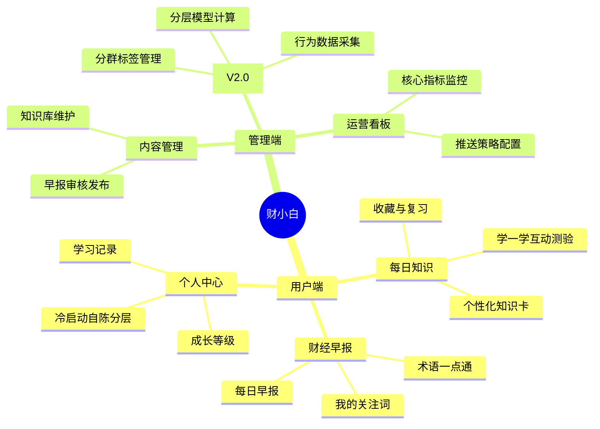
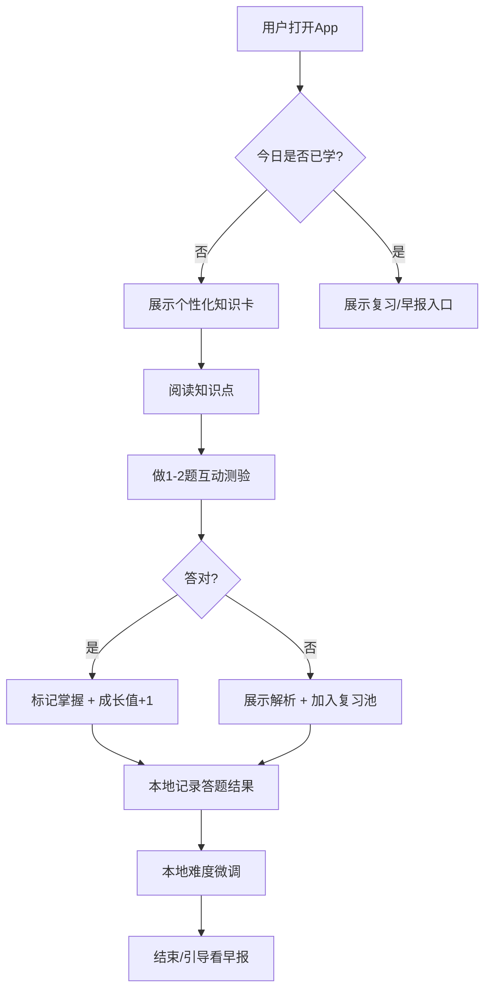
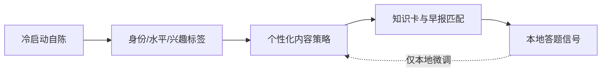
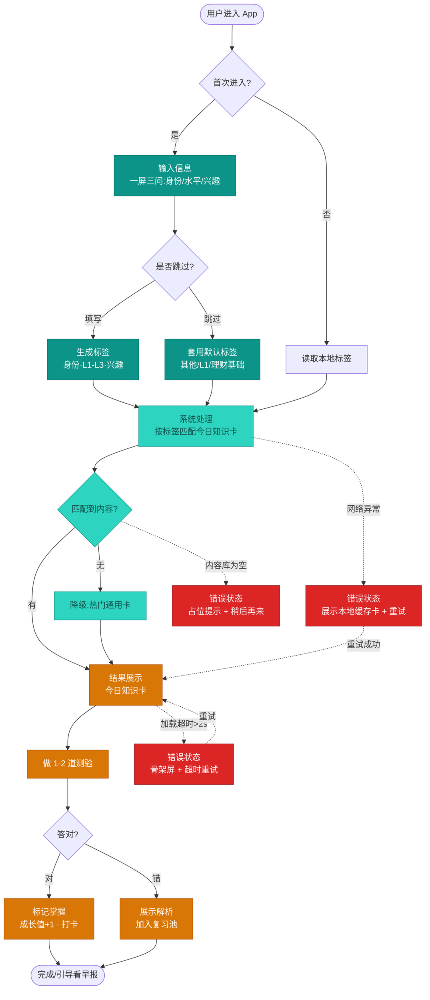

# 财小白 (FinRookie) 产品需求文档 (PRD)

## 1. 文档信息

| 字段 | 内容 |
|-----|------|
| 产品名称 | 财小白 (FinRookie) |
| 文档版本 | V1.1 (MVP) |
| 编写日期 | 2026-07-29 |
| 编写人 | 王仁懿 |
| 最后更新 | 2026-07-29 |

---

## 目录

- [2. 背景](#2-背景)
- [3. 目标用户](#3-目标用户)
- [4. 核心场景](#4-核心场景)
- [5. 产品架构](#5-产品架构)
- [6. 核心业务流程](#6-核心业务流程)
- [7. 功能列表](#7-功能列表)
- [8. 详细功能说明](#8-详细功能说明)
- [9. 非目标范围](#9-非目标范围out-of-scope)
- [10. 非功能需求](#10-非功能需求)
- [11. 验收标准](#11-验收标准)
- [12. 迭代规划](#12-迭代规划)
- [13. 附录](#13-附录)

---

## 2. 背景

### 2.1 业务背景

金融理财的需求正在向年轻、零基础人群下沉,但市面上的内容对新手极不友好:要么是充斥术语的专业资讯,要么是碎片化、真伪难辨的短视频。零基础用户普遍面临三个痛点——**看不懂**(术语门槛高)、**学不会**(缺乏体系、无从下手)、**坚持不了**(内容重、无正反馈)。

财小白定位为"轻量、低压力、每天5分钟"的金融启蒙工具,用**每日个性化知识卡**降低学习门槛,用**看得懂的财经早报**建立用户与真实市场的连接,用**冷启动自陈分层**在零合规风险下实现个性化,让零基础用户无压力地建立金融认知。

### 2.2 业务目标

MVP 阶段核心目标(上线后 3 个月内验证):

| 目标类别 | 指标 | 目标值 |
|---------|------|-------|
| 留存 | 次日留存 | ≥ 35% |
| 留存 | 7 日留存 | ≥ 20% |
| 习惯 | 日均知识卡打开率 | ≥ 40% |
| 习惯 | 知识卡读完率 | ≥ 60% |
| 分层基础 | 完成冷启动自陈的新用户占比 | ≥ 80% |

> 说明:MVP 不以"跑通服务端行为分层模型"为目标——分层由冷启动自陈直接提供,基于行为数据的自动分层是 V2.0 目标。

### 2.3 核心价值主张

**"每天5分钟,把金融小白喂成入门选手"** —— 用个性化的每日一课 + 看得懂的财经早报,让零基础用户无压力地建立金融认知。

---

## 3. 目标用户

### 3.1 用户画像

| 用户类型 | 用户画像 | 核心诉求 |
|---------|---------|---------|
| 职场新人 | 22-28岁,刚工作有闲钱,想理财但看不懂术语 | 用大白话讲清基础概念,别让我有压力 |
| 在校学生 | 18-24岁,好奇金融但零基础 | 碎片化、有趣、能坚持学下去 |
| 理财焦虑族 | 25-35岁,被各种资讯淹没,不知从何学起 | 帮我筛选、每天喂一点、循序渐进 |

### 3.2 用户角色定义

| 角色名称 | 角色描述 | 主要权限 |
|---------|---------|---------|
| 普通用户 | 金融新手,消费内容并进行学习 | 阅读知识卡/早报、答题、收藏、设置偏好 |
| 内容运营 | 维护知识库、审核发布早报 | 内容 CRUD、早报审核、发布 |
| 数据运营 | 管理用户分层与推送策略(V2.0) | 查看分群、调整标签、配置推送规则 |
| 系统管理员 | 平台管理 | 全部权限、账号管理、日志审计 |

---

## 4. 核心场景

以下场景描述真实用户在典型情境下如何使用财小白,作为功能设计与验收的依据。

### 场景一:新用户首次进入(冷启动)

> 小李,25岁职场新人,朋友推荐下载了财小白。首次打开,App 用一屏问了三个问题:"你是学生还是上班族?""金融水平如何?""想先学什么?"。小李选了"职场新人 / 完全没接触过 / 理财基础+基金",30 秒填完。系统立即为他打上标签,首页直接展示一张适合萌新的"什么是基金"知识卡——没有空白等待,第一秒就有个性化内容。

**对应功能**:F-08 冷启动自陈 → F-01 知识卡

### 场景二:通勤路上的每日一课

> 小李每天早上挤地铁时打开财小白。首页是今日知识卡"复利是怎么滚雪球的",两分钟读完,配了一个直观的例子。读完弹出一道判断题,他答对了,成长值 +1,连续打卡第 6 天。整个过程 3 分钟,下地铁正好学完。

**对应功能**:F-01 知识卡 → F-02 互动测验 → F-07 成长等级

### 场景三:睡前刷懂财经早报

> 小张,大三学生,睡前习惯刷手机。他点开财小白的"早报"Tab,当日 6 条精选要闻,每条都有一句新手视角的解读。看到"央行降准"时不懂,点了一下高亮的"降准",弹层用大白话解释了一遍,他顺手把这个术语收藏了。

**对应功能**:F-04 财经早报 → F-05 术语一点通 → F-03 收藏

### 场景四:周末集中复习

> 周末,小李想把这周答错的题再看一遍。他进入个人中心的"复习池",里面是这周答错的 3 道题和解析,还有他收藏的 5 张知识卡。花了 10 分钟过了一遍,把已经掌握的从复习池移除。

**对应功能**:F-03 收藏与复习 → F-07 学习记录

---

## 5. 产品架构

### 5.1 功能架构图

---

## 6. 核心业务流程

### 6.1 每日学习主流程(MVP)

> MVP 阶段答题结果仅在**本地**记录并用于难度微调,不回传服务端。

### 6.2 个性化推送闭环(MVP:自陈驱动)

> MVP 阶段用户分层不依赖服务端行为采集,而是由用户在冷启动时**自陈身份、自评水平、自选兴趣**直接得到标签;答题正确率仅在**本地**做轻量难度微调,不回传。基于行为数据的自动分层(修正自陈偏差)推迟至 V2.0,详见 §8.4。

### 6.3 最小产品流程(用户进入 → 输入 → 处理 → 结果 → 错误)

覆盖 MVP 端到端最小闭环的五个环节,含关键错误状态兜底。

| 环节 | 对应节点 |
|-----|---------|
| 用户进入 | 用户进入 App → 判断首次 |
| 输入信息 | 一屏三问(身份/水平/兴趣),含跳过分支 |
| 系统处理 | 按标签匹配知识卡 + 匹配判断 |
| 结果展示 | 今日知识卡 → 测验 → 掌握/复习 |
| 错误状态 | 网络异常(缓存兜底)、内容库为空(占位)、加载超时(骨架屏重试) |

---

## 7. 功能列表

按优先级与版本归属汇总全部功能。P0=MVP 必做,P1=次要,P2=可延后;版本列标明实际交付批次。

| 编号 | 功能名称 | 所属模块 | 优先级 | 版本 | 一句话描述 |
|------|---------|---------|:-----:|:----:|-----------|
| F-08 | 冷启动自陈分层 | 个人中心 | P0 | MVP | 一屏三问声明身份/水平/兴趣,直接生成个性化标签 |
| F-01 | 个性化知识卡 | 每日知识 | P0 | MVP | 每天推送 1 张按标签匹配的金融知识卡 |
| F-02 | 学一学互动测验 | 每日知识 | P0 | MVP | 知识卡配 1-2 道小测验,即时反馈+解析 |
| F-04 | 每日财经早报 | 财经早报 | P0 | MVP | 每日精选 5-8 条要闻,含新手视角一句话解读 |
| F-05 | 术语一点通 | 财经早报 | P1 | MVP | 点击专业术语弹出大白话解释 |
| F-03 | 收藏与复习 | 每日知识 | P1 | MVP | 收藏知识卡;答错题进复习池 |
| F-07 | 学习记录与成长等级 | 个人中心 | P1 | V1.1 | 展示打卡天数、掌握数、成长等级 |
| F-06 | 我的关注词 | 财经早报 | P2 | V1.1 | 设置关注词,命中新闻标记/前置 |
| F-11 | 内容管理与运营看板 | 管理端 | P1 | V1.1 | 内容 CRUD、早报审核发布、核心指标监控 |
| F-09 | 行为数据采集 | 管理端 | - | V2.0 | 全埋点采集学习行为,作为分层输入 |
| F-10 | 用户分层模型 | 管理端 | - | V2.0 | 基于行为数据分层打标,修正自陈偏差 |

> MVP 交付范围 = F-08 / F-01 / F-02 / F-04 / F-05 / F-03(共 6 项)。

---

## 8. 详细功能说明

### 8.1 每日知识模块

#### 8.1.1 个性化知识卡 【P0】

| 字段 | 说明 |
|-----|------|
| **功能编号** | F-01 |
| **功能描述** | 每天为用户推送 1 张金融知识卡(概念/常识/避坑),内容难度与主题依据用户标签动态匹配 |
| **前置条件** | 用户已完成冷启动自陈(或使用默认标签) |
| **优先级** | P0 |

**页面元素**:

| 元素 | 类型 | 说明 | 校验规则 |
|-----|------|-----|---------|
| 知识卡标题 | 文本 | 一句话讲清今天学什么 | 长度 ≤ 20 字 |
| 正文 | 富文本 | 大白话解释,配图/示例 | 阅读时长 ≤ 3 分钟 |
| 难度标签 | 标签 | 入门/进阶 | 枚举值 |
| 主题标签 | 标签 | 如"理财基础""股票""基金""避坑" | 关联知识库分类 |
| 收藏按钮 | 按钮 | 加入我的收藏 | - |

**交互逻辑**:

1. 用户打开 App,首页默认展示今日知识卡
2. 系统根据用户当前"学习能力档位 + 兴趣标签"从知识库匹配一张卡
3. 用户阅读后可点击"收藏"或直接进入测验
4. 本地记录:是否读完、是否收藏(用于难度微调,不回传)

**异常处理**:

| 异常场景 | 处理方式 |
|---------|---------|
| 用户未做冷启动 | 使用默认标签(入门内容),引导补选偏好 |
| 知识库无匹配内容 | 降级为热门通用知识卡 |
| 网络异常 | 展示本地缓存的最近一张卡 + 重试 |

---

#### 8.1.2 学一学互动测验 【P0】

| 字段 | 说明 |
|-----|------|
| **功能编号** | F-02 |
| **功能描述** | 每张知识卡配 1-2 道小测验(单选/判断),检验掌握并作为本地难度微调的信号 |
| **前置条件** | 用户已阅读对应知识卡 |
| **优先级** | P0 |

**交互逻辑**:

1. 阅读完知识卡后,进入 1-2 道选择题
2. 用户作答后立即反馈对错 + 解析
3. 答错的题目自动进入"复习池"
4. 本地记录:正确率、尝试次数 → 用于本地难度微调(不回传)

**异常处理**:

| 异常场景 | 处理方式 |
|---------|---------|
| 用户跳过测验 | 本地记录"跳过",不惩罚,不影响后续推送 |
| 连续答错 | 本地降低次日推送难度,展示鼓励文案 |

---

#### 8.1.3 收藏与复习 【P1】

| 字段 | 说明 |
|-----|------|
| **功能编号** | F-03 |
| **功能描述** | 用户可收藏知识卡;答错题进入复习池,支持定期复习 |
| **前置条件** | 有收藏内容或复习池非空 |
| **优先级** | P1 |

**交互逻辑**:

1. 知识卡与术语均可点击收藏,收藏列表在个人中心可见
2. 答错的题目自动入复习池,展示原题+解析
3. 复习时答对可将题目移出复习池
4. 收藏与复习数据存本地

---

### 8.2 财经早报模块

#### 8.2.1 每日财经早报 【P0】

| 字段 | 说明 |
|-----|------|
| **功能编号** | F-04 |
| **功能描述** | 每天固定时间(如 8:00)推送一份精选财经早报,聚合宏观/市场/公司要闻,面向新手做过滤与简化 |
| **前置条件** | 运营已审核发布当日早报 |
| **优先级** | P0 |

**页面元素**:

| 元素 | 类型 | 说明 | 校验规则 |
|-----|------|-----|---------|
| 早报日期 | 文本 | 当日日期 | - |
| 要闻列表 | 列表 | 5-8 条精选新闻,含一句话解读 | 每条 ≤ 100 字 |
| 术语高亮 | 交互文本 | 专业词点击弹出"一点通"解释 | 关联术语库 |
| 关注词标记 | 标签 | 命中用户关注词的新闻置顶/标记(V1.1) | - |

**交互逻辑**:

1. 用户进入"早报"Tab,展示当日早报
2. 每条要闻附**新手视角一句话解读**(降低理解门槛)
3. 遇到专业术语,点击弹层展示"术语一点通"
4. 本地记录:早报打开、术语点击(用于本地兴趣微调,不回传)

**异常处理**:

| 异常场景 | 处理方式 |
|---------|---------|
| 当日早报未发布 | 展示昨日早报 + "今日早报生成中" |
| 数据源异常 | 运营手动兜底发布,或展示占位提示 |

> 注:MVP 阶段早报内容由运营基于第三方财经资讯源(如财联社等)人工精选+简化并以静态形式发布,V1.1 起接入自动聚合。

---

#### 8.2.2 术语一点通 【P1】

| 字段 | 说明 |
|-----|------|
| **功能编号** | F-05 |
| **功能描述** | 新手看不懂的金融术语,点击即弹出大白话解释,沉淀为术语库 |
| **优先级** | P1 |

**交互逻辑**:

1. 早报与知识卡正文中的术语以高亮样式呈现
2. 点击弹出轻量弹层,展示 ≤ 80 字的大白话解释
3. 弹层内可收藏该术语

---

#### 8.2.3 我的关注词 【P2 · V1.1】

| 字段 | 说明 |
|-----|------|
| **功能编号** | F-06 |
| **功能描述** | 用户可设置关注词(如"基金""黄金"),早报中命中的新闻会被标记/前置 |
| **优先级** | P2(V1.1) |

---

### 8.3 个人中心模块

#### 8.3.1 学习记录与成长等级 【P1 · V1.1】

| 字段 | 说明 |
|-----|------|
| **功能编号** | F-07 |
| **功能描述** | 展示连续学习天数、累计掌握知识点、成长等级,强化学习习惯 |
| **优先级** | P1(成长等级 V1.1;MVP 仅展示连续打卡天数) |

#### 8.3.2 偏好设置(冷启动自陈) 【P0 · 核心差异化】

| 字段 | 说明 |
|-----|------|
| **功能编号** | F-08 |
| **功能描述** | 新用户首次进入时,用**一屏三问**主动声明身份、金融水平、兴趣主题,直接生成个性化标签,替代服务端行为采集分层,作为 MVP 的分层唯一来源 |
| **前置条件** | 用户完成注册,首次进入 App |
| **优先级** | P0 |

**一屏三问设计**:

| 问题 | 类型 | 选项 | 生成标签 |
|-----|------|-----|---------|
| 你的身份是? | 单选 | 在校学生 / 职场新人 / 其他 | `身份标签`,影响内容语境与举例(校园/职场场景) |
| 你的金融水平? | 单选 | 完全没接触过 / 懂一点 / 有点基础 | 直接映射学习能力档位 `L1 / L2 / L3` |
| 你想先学什么?(可多选) | 多选 | 理财基础 / 基金 / 股票 / 避坑 / 保险 | `兴趣主题标签`(多标签),用于知识卡与早报匹配 |

**交互逻辑**:

1. 首次进入展示"一屏三问",三题填完即可开始(≤ 30 秒)
2. 三个答案分别落为:身份标签、学习能力档位(L1-L3)、兴趣主题标签
3. 标签写入**本地存储**,立即用于首日 F-01 知识卡与 F-04 早报匹配,无冷启动空窗
4. 用户可在个人中心随时修改,修改后即时生效

**异常处理**:

| 异常场景 | 处理方式 |
|---------|---------|
| 用户跳过冷启动 | 使用默认标签(身份=其他 / 水平=L1 / 兴趣=理财基础),后续引导补选 |
| 自评与实际不符(高估水平) | MVP 阶段接受该偏差;由 F-02 答题正确率在**本地**做难度微调;系统性修正推迟至 V2.0 行为分层 |

> **为什么用自陈替代采集**:MVP 阶段用一次性自陈换取零冷启动、低合规风险、快速可交付;代价是拿不到客观的学习能力信号且用户可能高估自己,这正是 V2.0 引入行为分层要修正的问题。

---

### 8.4 管理端:用户分层模块 【V2.0 · 行为分层升级】

> **MVP 说明**:MVP 阶段的用户分层完全由 F-08 冷启动自陈提供(身份 / 水平 / 兴趣),**不做服务端行为采集与批量计算**。本节 F-09、F-10 描述的行为数据分层是 V2.0 的升级方向,目的是用客观行为数据**修正自陈偏差**(尤其是用户高估自己金融水平的情况),MVP 不实现。

#### 8.4.1 行为数据采集 【V2.0】

| 字段 | 说明 |
|-----|------|
| **功能编号** | F-09 |
| **功能描述** | 全埋点采集用户学习与阅读行为,作为分层模型的输入 |
| **优先级** | V2.0(MVP 不实现;MVP 仅在**本地**记录答题正确率用于难度微调,不回传服务端) |

**采集的核心行为数据**:

| 数据维度 | 采集字段 | 用途 |
|---------|---------|------|
| 学习能力 | 测验正确率、答题耗时、尝试次数、掌握速度 | 学习能力分档 |
| 参与度 | 连续打卡天数、日均停留时长、知识卡读完率、跳过率 | 活跃/流失预警 |
| 兴趣偏好 | 各主题点击/阅读占比、收藏主题分布、早报术语点击、关注词 | 兴趣标签 |
| 内容偏好 | 图文 vs 视频停留、难度接受度(进阶卡完成率) | 内容形态与难度策略 |

#### 8.4.2 用户分层模型 【V2.0】

| 字段 | 说明 |
|-----|------|
| **功能编号** | F-10 |
| **功能描述** | 基于采集数据,对用户在**学习能力**与**兴趣程度**两大维度分层打标,修正 F-08 自陈偏差 |
| **优先级** | V2.0(MVP 由 F-08 自陈直接给出档位与兴趣标签,不做行为计算) |

**分层模型设计(V2.0 版,规则引擎优先,后续可升级为模型)**:

**维度一:学习能力档位**

| 档位 | 判定信号(示例) | 内容策略 |
|-----|---------------|---------|
| L1 萌新 | 正确率 < 50% 或 新注册 < 3 天 | 纯入门、慢节奏、多鼓励 |
| L2 入门 | 正确率 50%-75% | 入门为主,穿插少量进阶 |
| L3 进阶 | 正确率 > 75% 且 进阶卡完成率高 | 提升难度、引入综合知识 |

**维度二:兴趣程度(活跃度)**

| 分群 | 判定信号(示例) | 运营策略 |
|-----|---------------|---------|
| 高活跃 | 连续打卡 ≥ 5 天,日均停留 > 5 分钟 | 增加深度内容、引导分享 |
| 普通 | 间歇性使用 | 推送提醒、激励打卡 |
| 沉睡预警 | ≥ 3 天未打开 | 召回推送、简化任务 |

**维度三:兴趣主题标签**(多标签)
- 基于各主题阅读/收藏占比,给用户打上如 `#基金爱好者` `#股票入门` `#理财避坑` 等标签,用于知识卡与早报的个性化匹配。

**交互逻辑(管理端)**:

1. 系统每日定时(T+1)批量计算全量用户分层标签
2. 数据运营在看板查看各分群规模与流转
3. 可按分群配置差异化推送策略(难度、主题、频次)
4. 标签回写至推送引擎,影响次日 F-01 知识卡匹配

**异常处理**:

| 异常场景 | 处理方式 |
|---------|---------|
| 数据不足(新用户) | 走冷启动自陈标签,累计 3 天后重算 |
| 标签频繁跳变 | 加入滑动窗口/衰减,避免单日波动误判 |

> **隐私合规**:所有行为数据采集须获得用户授权,遵循《个人信息保护法》,数据脱敏存储,提供用户数据导出/删除入口。

#### 8.4.3 内容管理与运营看板 【P1 · V1.1】

| 字段 | 说明 |
|-----|------|
| **功能编号** | F-11 |
| **功能描述** | 知识库/早报的内容维护、审核发布;核心指标(留存/打开率)监控 |
| **优先级** | P1(V1.1) |

---

## 9. 非目标范围(Out of Scope)

为聚焦 MVP 核心价值并控制风险,以下明确**不在 MVP 范围内**:

| # | 非目标项 | 说明 | 计划 |
|---|---------|------|------|
| 1 | 实盘交易 / 开户 / 买卖 | 不接入任何券商、基金交易通道,不提供下单能力 | 无计划 |
| 2 | 个股/基金投资建议、荐股 | 只做知识科普,不给出具体标的的买卖建议 | 无计划(合规红线) |
| 3 | 服务端行为埋点与自动分层 | MVP 分层完全靠冷启动自陈,行为数据仅本地用于难度微调、不回传 | V2.0(F-09/F-10) |
| 4 | 社区 / UGC / 社交分享 | 无评论、无发帖、无关注他人 | V2.0 |
| 5 | 短视频 / 音频等富媒体内容 | MVP 内容形态限于图文 | V2.0 |
| 6 | 运营看板与推送策略后台 | MVP 无数据大盘,靠外部工具看指标 | V1.1(F-11) |
| 7 | 早报自动聚合 | MVP 早报由运营人工精选+简化并静态发布 | V1.1 |
| 8 | 积分 / 金币 / 激励体系 | 不做虚拟货币与兑换 | 待评估(V1.1) |
| 9 | 关注词个性化前置 | MVP 早报统一排序,不做关注词命中前置 | V1.1(F-06) |
| 10 | 成长等级体系 | MVP 仅展示连续打卡天数,不做等级/勋章 | V1.1(F-07) |
| 11 | 多语言 / 国际化 | 仅简体中文 | 无计划 |
| 12 | PC Web / 平板专用端 | 仅做移动端 | 无计划 |

---

## 10. 非功能需求

### 10.1 性能要求

| 指标 | 要求 |
|-----|------|
| 接口响应时间 | ≤ 300ms |
| 知识卡/早报加载 | ≤ 2s |
| 冷启动自陈标签生成 | 本地即时(< 100ms) |
| 分层批量计算(V2.0) | 全量用户 T+1 内跑完 |
| 并发用户数 | MVP ≥ 500 |

### 10.2 安全与合规要求

- [ ] 用户个人信息加密存储
- [ ] MVP 学习行为数据仅存本地、不回传;如需回传须明确授权并提供隐私政策与撤回入口
- [ ] 接口权限校验、防注入/XSS
- [ ] 内容合规:金融内容须做免责声明("仅供学习,不构成投资建议")
- [ ] 操作日志与数据访问审计

### 10.3 兼容性要求

| 维度 | 支持范围 |
|-----|---------|
| 平台 | iOS / Android(MVP 可先做其一或用跨端方案) |
| 分辨率 | 主流手机屏 375×667 起 |
| 网络 | 弱网降级、本地缓存 |

---

## 11. 验收标准

### 11.1 功能验收(MVP 逐项)

采用"给定条件 → 操作 → 预期结果"格式,每项功能须全部通过方可验收。

| 编号 | 功能 | 验收标准 |
|------|------|---------|
| F-08 | 冷启动自陈 | ① 新用户首次进入必现"一屏三问";② 三题作答后生成身份/水平(L1-L3)/兴趣标签并写入本地;③ 完成后首页立即展示与标签匹配的知识卡,无空白等待;④ 跳过时套用默认标签且不阻塞进入;⑤ 个人中心可修改,改后即时生效 |
| F-01 | 个性化知识卡 | ① 每日进入首页展示 1 张知识卡;② 卡片含标题(≤20字)、正文、难度标签、主题标签、收藏按钮;③ 卡片主题命中用户兴趣标签;④ 无匹配时降级为通用卡而非报错;⑤ 断网时展示本地缓存卡 |
| F-02 | 互动测验 | ① 读完知识卡后出现 1-2 道题;② 作答后立即显示对错+解析;③ 答错题自动进入复习池;④ 正确率在本地记录并影响次日难度;⑤ 可跳过,跳过不报错、不惩罚 |
| F-04 | 财经早报 | ① "早报"Tab 展示当日早报;② 5-8 条要闻,每条含 ≤100 字新手解读;③ 术语以高亮呈现且可点击;④ 当日未发布时展示昨日早报+提示;⑤ 附"不构成投资建议"免责声明 |
| F-05 | 术语一点通 | ① 点击高亮术语弹出解释弹层;② 解释为大白话且 ≤80 字;③ 弹层内可收藏术语;④ 术语库缺失时优雅降级(不弹空层) |
| F-03 | 收藏与复习 | ① 知识卡/术语可收藏且在个人中心可见;② 答错题进入复习池并展示原题+解析;③ 复习答对可移出复习池;④ 收藏/复习数据本地持久化,重启不丢失 |

### 11.2 非功能验收

| 类别 | 验收标准 |
|-----|---------|
| 性能 | 首页知识卡加载 ≤ 2s;冷启动标签生成本地即时;弱网下有降级展示 |
| 兼容 | 在 iOS/Android 主流机型、375×667 起分辨率正常显示,无横向滚动、无布局错位 |
| 合规 | 全站金融内容含免责声明;MVP 无任何行为数据回传服务端;隐私政策可查 |
| 稳定 | 核心路径(冷启动→知识卡→测验→早报)无崩溃、无死循环;断网不白屏 |

### 11.3 发布准出标准(Release Criteria)

- [ ] 11.1 中 6 项 MVP 功能验收标准全部通过
- [ ] 11.2 非功能验收全部通过
- [ ] 至少 1 周知识卡内容 + 1 周早报内容已就位(运营侧)
- [ ] 关键路径埋点(本地)可产出留存/打开率/读完率/冷启动完成率的可统计数据
- [ ] 无 P0/P1 级已知缺陷
- [ ] 金融内容免责声明与隐私政策审核通过

### 11.4 上线后成功标准(3 个月内)

对齐 §2.2 业务目标:次日留存 ≥ 35%、7 日留存 ≥ 20%、日均知识卡打开率 ≥ 40%、知识卡读完率 ≥ 60%、冷启动完成率 ≥ 80%。

---

## 12. 迭代规划

| 版本 | 包含功能 | 预计上线时间 |
|-----|---------|-------------|
| MVP | F-08 冷启动自陈分层、F-01 个性化知识卡、F-02 互动测验、F-04 财经早报(人工精选静态)、F-05 术语一点通、F-03 收藏复习 | 2026-09 |
| V1.1 | F-07 成长等级、F-06 关注词、早报自动聚合、F-11 运营看板 | 2026-10 |
| V2.0 | F-09 行为数据采集、F-10 行为分层模型(修正自陈偏差,规则版→机器学习)、社区/分享、内容形态扩展(短视频) | 2026-12 |

---

## 13. 附录

### 13.1 术语表

| 术语 | 解释 |
|-----|------|
| 知识卡 | 单条金融知识的最小学习单元,图文形式 |
| 学习能力档位 | 用户金融水平的分档(L1 萌新 / L2 入门 / L3 进阶),MVP 由自陈得出 |
| 兴趣程度 | 依据活跃与参与行为对用户的分群(高活跃/普通/沉睡),V2.0 引入 |
| 冷启动 | 新用户无历史数据时的内容分发策略;MVP 用一屏三问自陈实现 |
| 自陈分层 | 由用户主动声明身份/水平/兴趣得到标签,替代行为采集的轻量分层方式 |
| 复习池 | 用户答错题目的集合,用于后续复习 |

### 13.2 待确认问题(Open Issues)

1. MVP 首发平台:iOS / Android / 跨端(如 Flutter)?
2. 早报内容来源:自建编辑 vs 第三方资讯 API 授权?
3. 自陈选项的措辞与颗粒度需与运营确认(身份/水平/兴趣的具体选项)。行为分层的维度权重与阈值推迟至 V2.0 定标。
4. 是否引入积分/激励体系提升打卡留存(建议 V1.1 评估)。

---

*文档结束*
