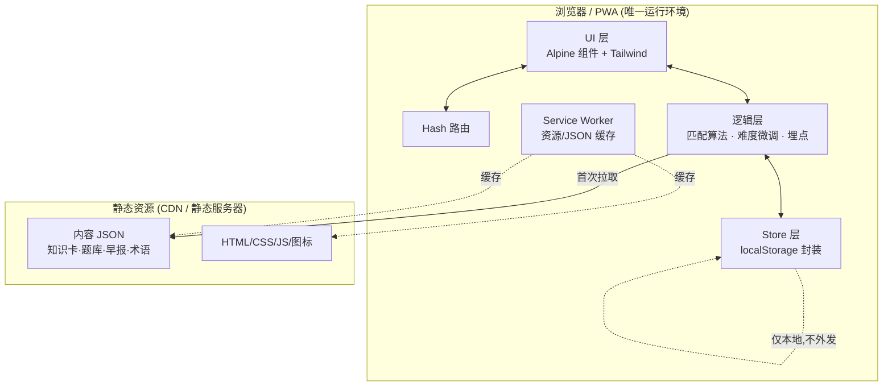

# 财小白 (FinRookie) MVP 技术方案

| 字段 | 内容 |
|-----|------|
| 关联文档 | PRD.md (V1.1 MVP) |
| 编写人 | 王仁懿 |
| 日期 | 2026-07-29 |
| 方案定位 | 阶段一 MVP:纯前端静态站(两天可交付);阶段二起补后端(演进蓝图,见 §11) |
| 核心约束 | 两天可交付 · 全前端 · 数据本地不回传 · 弱网可用 |

---

## 0. 技术选型

| 决策 | 选择 | 备选 | 理由 |
|-----|------|-----|-----|
| 形态 | 移动端 H5 + PWA | 原生 / 跨端 | 两天内出可演示成品,避开原生构建链;PWA 满足"添加到主屏"+离线 |
| 框架 | Alpine.js(响应式状态)+ Tailwind(样式),均 CDN | Vue、React | 零构建、零打包;有响应式又无 webpack;贴合 ui-ux-pro-max 的 html-tailwind 栈 |
| 路由 | 原生 hash 路由(约 30 行) | vue-router | 三 Tab 场景无需重型路由库 |
| 存储 | localStorage(封装 store 层) | IndexedDB | 数据量小(KB 级);IndexedDB 对 MVP 过重,列为 V1.1 迁移项 |
| 内容 | 静态 JSON(随前端部署) | 后端 API | 无服务端即零合规;弱网可缓存 |
| 后端 | 无(阶段一) | —— | 分层靠自陈、数据本地,MVP 不需要 |

> **选型主线**:用"零构建 + 静态资源 + 本地存储"换取两天交付与零合规负担;所有需要服务端的能力(账号、云同步、埋点上报、内容后台)统一推到阶段二。

---

## 1. 系统架构

### 1.1 整体架构(阶段一)



### 1.2 分层职责

| 层 | 职责 | 关键点 |
|---|-----|-------|
| UI 层 | 页面渲染、交互 | Alpine 组件化;无障碍(WCAG:焦点环、alt、对比度) |
| 路由层 | 三 Tab + 浮层切换 | hash 驱动,前进/后退可用 |
| 逻辑层 | 标签映射、知识卡匹配、难度微调、本地埋点 | 纯函数,便于手工验证 |
| Store 层 | localStorage 读写、schema 版本、容错 | 统一入口,JSON.parse 全 try/catch,读坏即降级默认值 |
| SW 层 | 缓存静态资源与内容 JSON | 断网可打开,呼应 PRD 弱网降级 |

---

## 2. 页面结构

底部三 Tab + 首启引导 + 若干浮层。

```
财小白 H5 (SPA, hash 路由)
├── 引导页 #/onboarding       (仅首启;F-08 一屏三问)
├── [Tab1] 今日 #/home        (F-01 知识卡 → F-02 测验入口)
│     └── 测验浮层             (F-02 答题 → 对错解析)
├── [Tab2] 早报 #/briefing    (F-04 要闻列表)
│     └── 术语弹层             (F-05 点击术语弹出;各页共用)
└── [Tab3] 我的 #/me          (F-07 打卡 · F-03 收藏/复习池 · 偏好设置)
      ├── 收藏列表
      ├── 复习池              (F-03 答错题重做)
      └── 偏好设置             (复用 F-08 组件改标签)
```

**页面 → 功能 → 数据 映射:**

| 页面 | 承载功能 | 读取 | 写入(localStorage) |
|-----|---------|-----|-------------------|
| 引导页 | F-08 | cards/glossary 预热 | `user.tags` |
| 今日 | F-01 / F-02 | knowledge-cards、quiz | `progress`、`review`、`favorites` |
| 早报 | F-04 / F-05 | briefings/日期、glossary | `favorites.terms`、`read` |
| 我的 | F-03 / F-07 | localStorage 全量 | `user.tags`、`review` |

### 2.1 组件拆分

| 组件 | 复用于 | 说明 |
|-----|-------|-----|
| `<OnboardingWizard>` | 引导页、偏好设置 | 一屏三问,产出标签 |
| `<KnowledgeCard>` | 今日、收藏列表 | 卡片展示 + 收藏按钮 |
| `<QuizFlow>` | 今日、复习池 | 答题 → 判定 → 解析 |
| `<TermPopover>` | 早报、知识卡正文 | 全局术语弹层,监听 `[data-term]` 点击 |
| `<BriefingList>` | 早报 | 要闻列表 + 解读 |
| `<TabBar>` | 全局 | 底部导航 |

---

## 3. 数据模型

### 3.1 localStorage Schema(用户数据,本地)

单一命名空间键 `finrookie:v1`,值为一个 JSON 对象,便于整体读写与 schema 版本管理。

```json
{
  "schemaVersion": 1,
  "user": {
    "tags": {
      "identity": "worker",          // student | worker | other
      "level": "L1",                 // L1 | L2 | L3(自陈映射)
      "interests": ["basics", "fund"]// 多选主题标签
    },
    "onboardedAt": "2026-09-01T08:00:00+08:00",
    "skippedOnboarding": false
  },
  "progress": {
    "streak": 6,                     // 连续打卡天数
    "lastCheckIn": "2026-09-06",     // 最近打卡日(算 streak)
    "seenCardIds": ["c001","c002"],  // 已学卡,避免重复推
    "quizStats": { "attempts": 12, "correct": 9 }  // 本地正确率信号
  },
  "difficulty": { "current": "L1", "consecutiveWrong": 0 },  // 本地难度微调状态
  "review": [                        // 复习池(答错题)
    { "quizId": "q014", "cardId": "c007", "wrongAt": "2026-09-05", "cleared": false }
  ],
  "favorites": {
    "cards": ["c003"],
    "terms": ["降准"]
  },
  "events": []                       // 本地埋点缓冲(§7),不外发
}
```

**Store 层约定:**
- 所有读操作经 `store.get(path, default)`,`JSON.parse` 失败 / 键缺失 → 返回默认值(不崩)。
- 写操作 `store.set(path, value)` 后立即持久化;超 `QuotaExceededError` → 清理 `events` 缓冲后重试。
- `schemaVersion` 不匹配 → 走迁移函数(阶段一仅 v1,预留)。

### 3.2 静态内容 JSON Schema

**知识卡 `knowledge-cards.json`**
```json
[{
  "id": "c007",
  "title": "复利是怎么滚雪球的",        // ≤20字
  "body": "<p>大白话正文,可含 <span data-term=\"复利\">复利</span> 术语标记</p>",
  "difficulty": "L1",                  // L1入门 | L2 | L3进阶
  "topics": ["basics"],                // 关联兴趣标签
  "quizIds": ["q014"]
}]
```

**题库 `quiz.json`**
```json
[{
  "id": "q014", "cardId": "c007", "type": "single", // single | judge
  "stem": "复利和单利的区别是?",
  "options": ["利滚利","只算本金","没区别"],
  "answer": 0,
  "explain": "复利会把利息计入下一期本金……"       // 解析
}]
```

**早报 `briefings/2026-09-01.json`**
```json
{
  "date": "2026-09-01",
  "disclaimer": "仅供学习,不构成投资建议",
  "items": [{
    "title": "央行今日降准0.5个百分点",
    "summary": "原文摘要≤100字",
    "plain": "新手解读:银行能放更多钱……",        // 新手视角一句话
    "terms": ["降准"]
  }]
}
```

**术语库 `glossary.json`**
```json
{ "降准": "央行让银行少交点准备金,市场上钱变多……(≤80字)" }
```

---

## 4. 核心算法

### 4.1 自陈 → 标签映射(F-08)

纯查表,无计算:

| 输入 | 映射 |
|-----|-----|
| 身份单选 | student / worker / other(影响文案语境,不影响难度) |
| 水平单选 | 没接触过 → `L1`;懂一点 → `L2`;有基础 → `L3` |
| 兴趣多选 | 直接存为 `interests[]` |

跳过 → 默认 `{identity:other, level:L1, interests:[basics]}`。

### 4.2 知识卡匹配(F-01)

```
候选 = cards.filter(未在 seenCardIds)
      .filter(difficulty == difficulty.current)          // 难度对齐
      .filter(topics ∩ user.interests ≠ ∅)               // 命中兴趣
排序:兴趣重合度高 → 优先
若候选为空:放宽难度(±1档)→ 仍空:放宽兴趣(热门通用卡)→ 仍空:任意未学卡
全部学完:进入"复习模式",从 review 池 / 收藏复习
```

三级降级保证"永远有卡可出",对齐 PRD F-01 异常处理。

### 4.3 本地难度微调(替代服务端分层)

每次答题后在本地更新 `difficulty`:

```
答对:  consecutiveWrong = 0
        若近 5 题正确率 > 75% 且 current < L3 → current 升一档
答错:  consecutiveWrong += 1
        若 consecutiveWrong ≥ 2 且 current > L1 → current 降一档,展示鼓励文案
```

- 只读写 localStorage,**不回传**,零合规。
- 自陈 `level` 为初始档,微调在其基础上浮动 → 缓解"用户高估自己"(PRD 已记录的权衡点)。

### 4.4 连续打卡(F-07)

```
今日已打卡?          → 幂等,不重复+1
lastCheckIn == 昨天?  → streak += 1
lastCheckIn <  昨天?  → streak = 1(断签重置)
更新 lastCheckIn = 今天
```

---

## 5. 数据来源

| 数据集 | 文件 | 生产方式 |
|-------|------|--------|
| 知识卡 | `/data/knowledge-cards.json` | 运营手写,≥1 周量 |
| 题库 | `/data/quiz.json` | 与知识卡一一关联 |
| 财经早报 | `/data/briefings/YYYY-MM-DD.json` | 运营人工精选+简化(可借 MCP 取素材,见 §8) |
| 术语库 | `/data/glossary.json` | 运营维护,大白话解释 |
| 用户数据 | `localStorage` | 本地,不回传 |

---

## 6. 异常与降级策略

| 场景 | 策略 | 关联 |
|-----|------|-----|
| 内容 JSON 拉取失败 | SW 缓存兜底 → 无缓存则展示占位+重试 | F-01/F-04 |
| 知识卡无匹配 | §4.2 三级降级,永不空屏 | F-01 |
| 当日早报未发布 | 回退展示最近一期 + "今日生成中" | F-04 |
| 术语库缺该词 | 弹层显示"暂无解释",不弹空层 | F-05 |
| localStorage 读到坏值 | Store 层 try/catch → 返回默认值 | 全局 |
| localStorage 写满 | 清 `events` 缓冲后重试 | §7 |
| 加载超时 >2s | 骨架屏 + 超时重试按钮 | 性能 |
| JS 运行时错误 | 全局 `onerror` 兜底提示,不白屏 | 稳定性 |

---

## 7. 埋点方案(阶段一:仅本地)

- 事件写入 `events[]` 缓冲(如 `card_view`、`quiz_answer`、`briefing_open`、`term_click`、`onboarding_done`),**仅本地留存,不上报**。
- 用途:驱动 §4.3 难度微调、§4.4 打卡;开发期可在"我的"页藏一个 debug 面板导出验证。
- 之所以本地:MVP 明确不做服务端行为采集(PRD 决策),规避《个人信息保护法》义务。
- 阶段二接入上报后,同一套事件结构直接复用(见 §11)。

> **合规红线**:阶段一抓包应确认 **无任何用户行为数据外发**(测试计划 §10 已列)。

---

## 8. 是否使用 MCP

**运行时:不使用。** 前端不调用任何 MCP,保证离线与零合规。

**内容生产时(可选):使用。** 运营准备静态 JSON 时离线调用:

| MCP | 用途 |
|-----|-----|
| `fintool-search`(search_news / get_alpha_morning) | 拉当日财经要闻作早报初稿 |
| `fintool-macro` / `fintool-quote` | 补宏观/行情数据点 |

产物人工审核简化后写入 `briefings/*.json`。**MCP 是 build-time 内容辅助,非 runtime 依赖。**

---

## 9. 是否使用 Skill

仅开发/内容阶段用,**不嵌入产品**:

| Skill | 用途 | 阶段 |
|-------|-----|-----|
| `ui-ux-pro-max` | 设计系统(青绿+琥珀、无障碍)、组件规范 | 设计 |
| `news-interpret` | 原始新闻 → 新手视角一句话解读 | 内容 |
| `finstep-static-deploy` | 静态产物一键部署为可访问 URL | 部署 |
| `frontend-design` / `dataviz` | 视觉细化、打卡可视化 | 开发 |

产品本体是纯静态站,**无 Skill 运行时调用**。

---

## 10. 部署方式

1. **构建**:无打包——`index.html` + CDN + `/data/*.json` + `/assets` 即产物。
2. **部署**:优先 `finstep-static-deploy` skill;或沿用现有静态服务器。
3. **PWA**:`manifest.json` + Service Worker 缓存资源与 JSON → 可安装、离线可用。
4. **版本**:内容 JSON 加 `?v=构建号` 破缓存;SW 用 cache 版本号控制更新。

> 上架:阶段二用 WebView 壳(Capacitor)包同一份 H5 成 iOS/Android,不重写。

---

## 11. 后端演进蓝图(阶段二起,不在两天内)

阶段一所有本地能力都为平滑接后端预留了同构结构:

| 能力 | 阶段一(前端) | 阶段二(补后端) |
|-----|-------------|---------------|
| 账号 | 无,匿名本地 | 手机号/微信登录,本地数据首登迁移上云 |
| 内容 | 静态 JSON | 内容管理后台 + 内容 API(F-11) |
| 分层 | 自陈 + 本地难度微调 | 行为埋点上报 → 服务端分层修正自陈偏差(F-09/F-10) |
| 埋点 | `events[]` 本地 | 同结构上报至数据管道 |
| 早报 | 人工静态 | 自动聚合 + 审核发布 |
| 同步 | localStorage | 云端同步收藏/复习/进度 |

**接口预留**:Store 层抽象为 `Repository` 接口(`getCards`/`getBriefing`/`saveProgress`…),阶段一实现为"读静态 JSON + 写 localStorage",阶段二换实现为"调 API",**UI 与逻辑层不改**。

> 引入后端即触发合规义务(授权、脱敏、导出/删除入口),需在阶段二方案专项设计。

---

## 12. 技术风险

| 风险 | 影响 | 缓解 |
|-----|-----|-----|
| CDN(Alpine/Tailwind)不可达 | 页面不可用 | SW 缓存 CDN 资源;或本地内联备份 |
| localStorage 容量/被清 | 数据丢失 | 数据量控制在 KB 级;关键操作即时持久化;V1.1 迁 IndexedDB |
| 自陈失真(高估水平) | 初始难度偏高 | §4.3 本地微调快速回调;阶段二行为分层根治 |
| 静态早报时效性 | 内容滞后 | 运营每日发布流程;阶段二自动聚合 |
| 无账号→换设备丢数据 | 体验断裂 | MVP 接受;阶段二账号+云同步 |

---

## 13. 测试计划

对齐 PRD §11,两天版以**手工 + 清单**为主,不引入重测试框架。

### 13.1 功能验收(逐功能,GWT)

跑 PRD §11.1 的 6 张验收表:F-08 / F-01 / F-02 / F-04 / F-05 / F-03(标签生成、每日出卡与降级、答题解析与错题入池、早报解读与免责、术语弹层、收藏复习持久化)。

### 13.2 非功能测试

| 类型 | 方法 |
|-----|-----|
| 兼容 | DevTools 模拟 375×667 起 + 真机 iOS/Android 各一;无横向滚动/错位 |
| 性能 | Lighthouse 首页;知识卡加载 ≤2s;冷启动标签即时 |
| 离线/弱网 | DevTools 断网 → PWA 缓存 + 本地兜底不白屏 |
| 数据持久 | 关闭重开浏览器,标签/收藏/复习池/打卡仍在 |
| 合规 | 全站含免责声明;**抓包确认无用户行为数据外发** |

### 13.3 算法单测(轻量)

对 §4 纯函数用浏览器 console 或极简断言脚本验证:
- 标签映射:三档水平 → L1/L2/L3 正确
- 匹配降级:候选为空时逐级放宽,永不返回空
- 难度微调:连对升档、连错(≥2)降档边界
- 打卡:连续/断签/幂等三种路径

### 13.4 冒烟清单(每次改动)

首启引导 → 出卡 → 答题 → 看早报 → 点术语 → 收藏 → 我的页复习 → 重开数据在。

### 13.5 准出标准

PRD §11.3 全绿:6 功能验收通过、非功能通过、≥1 周内容就位、无 P0/P1 缺陷、免责/隐私审核通过。

---

*文档结束*
